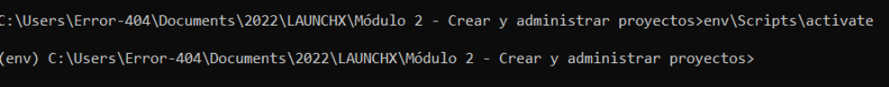
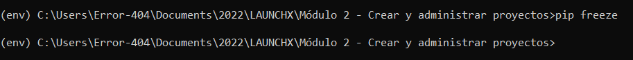
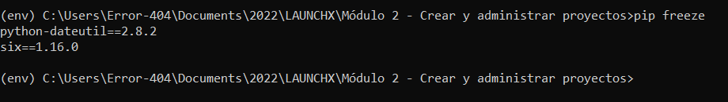
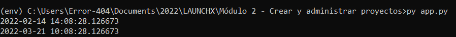
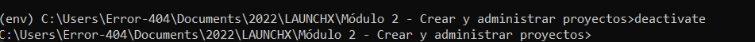

> Ejercicio - Crear un paquete

En este ejercicio, aprenderás a utilizar entornos virtuales como una forma para no afectar a los paquetes instalados globalmente u otros programas que se ejecutan en tu máquina.

*Para este ejercicio es necesario que lo ejecutes desde la terminal, línea de comandos, cmd, consola, cli, etc. de tu computadora, sé que es desafíante, pero no te preocupes ¡¡Sé que puedes lograrlo!!*

## Crear un entorno virtual

1. Crea un entorno virtual
   En mi caso ejecute en mi terminal:  `python -m venv env`

   
2. Habilitar entono virtua : **env\Scripts\activate**Instalación de biblioteca
   Instalar una biblioteca

   
3. Ahora que estás dentro de tu entorno virtual, puedes instalar una biblioteca y saber que la biblioteca solo existirá en el entorno virtual.
   Ejecuta el comando ``pip freeze`` para ver las bibliotecas instaladas en tu entorno:
   No deberías obtener respuesta. A continuación, veamos cómo cambia la salida de ``pip freeze`` cuando se agrega una biblioteca (un paquete).
4. Instalando biblioteca: **pip install python-dateutil**

   
5. Se revisa el listado de bibliotecas: **pip freeze
   **
6. Ejecución de app.py

   
7. Desactivar un entorno virtual
   Hasta ahora, has creado un entorno virtual y le has agregado un paquete. Sin embargo, es posible que estés trabajando en varios proyectos de Python y necesites cambiar entre ellos. Para hacer eso, debes salir (desactivar) tu entorno virtual.
   Ejecuta el comando ``deactivate``

   

